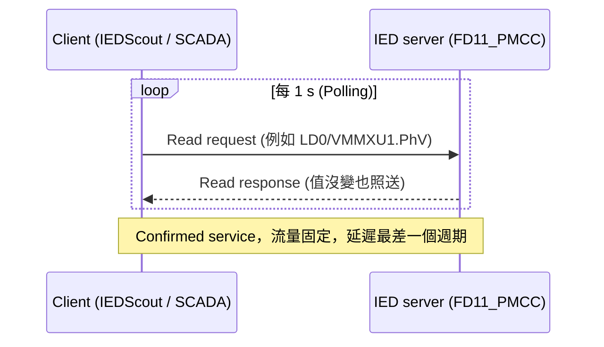
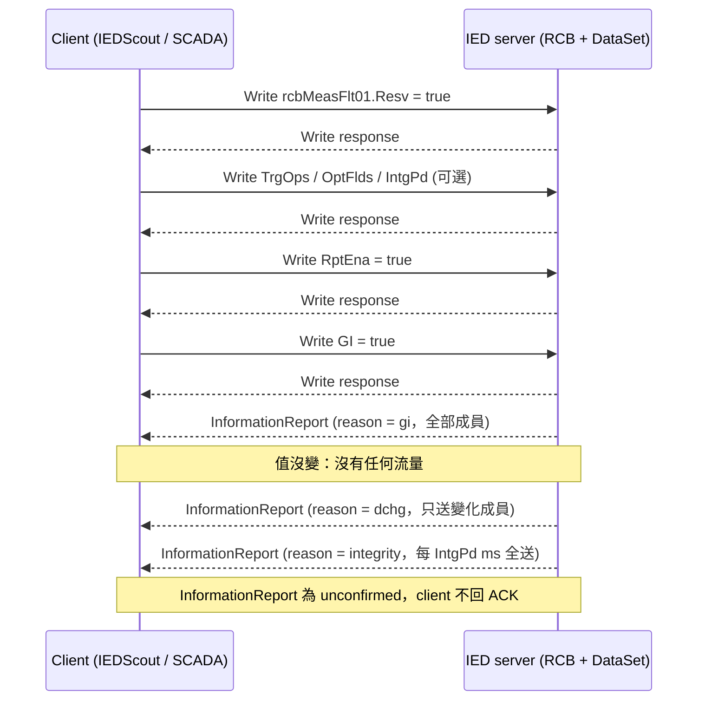

# IEDScout 與 IEC 61850 MMS Report 知識整理 (IEDScout and MMS Report Notes)

> 來源：2026-10-08 與 Claude 的對話整理，依問題順序重組為知識結構。
> 目的：供 Claude Code 讀取後，擴充既有的 GitHub 知識網站 (獨立站台，已有部分內容)。
> 標示慣例：凡是從畫面或命名推論、尚未在 DUT 上驗證的內容，一律標「未確認」，請勿寫成事實。

---

## 0. 給 Claude Code 的工作指示 (Instructions for Claude Code)

1. 先完整閱讀本檔，建立對實驗環境與知識範圍的理解。
2. 盤點既有知識網站的 repo：資訊架構 (IA)、既有頁面清單、Markdown 方言、是否支援 Mermaid、樣式與導覽方式。
3. 比對本檔與既有內容：哪些已存在 (只需補充或互連)、哪些是新頁面、哪些需要合併；避免重複頁面。
4. 先提出擴充計畫 (新增/修改頁面清單、放置位置、互連方式)，取得確認後再動手，不要直接覆寫既有頁面。
5. 寫作風格：繁體中文 (台灣用語)，英文技術名詞保留並以括號標示；多用 Markdown 表格與 checklist；雙語標題 (中文 + English)；全文不使用破折號 (改用逗號、括號、冒號或重組句子)。
6. 時序圖優先使用 Mermaid (第 4 節已提供)；若站台不渲染 Mermaid，改為 SVG 或 ASCII，由你判斷。
7. 第 6 節「待驗證清單」請保留為 checklist 形式，不要改寫成結論。
8. 第 7 節「測試觀察點」是否納入知識站台，依站台定位判斷；若站台是純協定知識，可省略或放到獨立的測試筆記區。

---

## 1. 實驗環境現況 (Lab setup snapshot)

| 項目 | 值 | 狀態 |
|---|---|---|
| Client 軟體 | OMICRON IEDScout (Browser 分頁 + Activity Monitor)；視窗右下顯示 `CM350Q` | `CM350Q` 推測為 OMICRON 硬體或授權識別，未確認 |
| IED 名稱 | `FD11_PMCC` | 已確認 (畫面) |
| IED IP | `192.168.2.11` | 已確認 (畫面) |
| Logical Device | `LD0` | 已確認 |
| 訂閱的 RCB | `FD11_PMCCLD0/LLN0.rcbMeasFlt01` | 已確認；是 URCB (RP) 或 BRCB (BR) 未確認 |
| 對應 DataSet | 推測為 `MeasFlt` | 由 RCB 名稱推斷，須讀 `DatSet` 屬性確認 |
| IED 廠牌 | 命名風格 (`CMMXU`、`VMMXU`、`PEMMXU`、`FMMXU`、`RESCMMXU`、`RESVMMXU`、`CSMSQI`、`VSMSQI`、`rcbMeasFlt`) 疑似 ABB Relion 615/620 系列 | 未確認，請以 IED properties 或 ICD/CID 為準 |
| Browser 分頁輪詢週期 | `Polling: 1 s` | 已確認 |
| 觀察時間 | 2026-10-07 14:26:51.656 (取自 `VMMXU1.PhV.phsA.t`) | 已確認 |

### 1.1 畫面可見的 LN 清單 (Visible logical nodes, partial)

`SFAIGGIO1`、`SFLINF1`、`SGBOGGIO1`、`SGLINF1`、`SMVLSVS1`、`SPCGAPC1`、`SPH1SCBR1`、`SPH2SCBR1`、`SPH3SCBR1`、`SSCBR1`、`SSIMG1`、`SSOPM1`、`TOFGAPC1`、`TONGAPC1`、`TONGAPC2`、`UL1TVTR1`、`UL2TVTR1`、`UL3TVTR1`、`VAVMMXU1`、`VMMXU1`

(清單為捲動視窗的一部分，非完整；`SSCBR`、`SSIMG`、`SSOPM` 為 IEC 61850-7-4 Ed.2 的監視類 LN。)

### 1.2 Activity Monitor 觀察到的值 (Observed report values)

| DataSet 成員 (FC = MX) | 值 |
|---|---|
| `LD0/CSMSQI1.SeqA` | 無值 (顯示短橫線) |
| `LD0/VSMSQI1.SeqV` | 無值 |
| `LD0/RESVMMXU1.PhV` | 無值 |
| `LD0/CMMXU1.A` | 32.006 A, 32.006 A, 32.006 A |
| `LD0/VMMXU1.PPV` | 21.717 kV, 21.717 kV, 21.717 kV |
| `LD0/PEMMXU1.TotW` | -261.152 kW |
| `LD0/PEMMXU1.TotVAr` | -1178.835 kVAr |
| `LD0/PEMMXU1.TotVA` | 1207.42 kVA |
| `LD0/PEMMXU1.TotPF` | -0.216 |
| `LD0/FMMXU1.Hz` | 59.961 Hz (卡片帶 ⚠ 警告符號，標籤為黃底) |
| `LD0/RESCMMXU1.A` | 無值 |
| `LD0/VMMXU1.PhV` (相量圖卡片) | 12.537 kV ∠0° / ∠-119.917° / ∠+120.087°，外圈刻度 20.00 kV |

### 1.3 Browser 分頁的 VMMXU1 屬性 (Left panel, VMMXU1)

| 屬性 | FC | 值 |
|---|---|---|
| `Mod` | | on |
| `Beh` | | on |
| `PPV` | MX | 21.717 kV ×3 |
| `PhV.phsA.cVal.mag` | MX | 12.537 kV |
| `PhV.phsA.cVal.ang` | MX | 0° |
| `PhV.phsA.q` | MX | good |
| `PhV.phsA.t` | MX | 2026-10-07 14:26:51.656 |
| `PhV.phsA.units` | CF | kV |
| `PhV.d` | DC | "VMMXU1 Phase to ground vol..." (截斷) |
| `PhV.phsB` | MX | 12.539 kV ∠-119.917° |
| `PhV.phsC` | MX | 12.537 kV ∠120.087° |
| `Blk` | | false |
| `HiAlm` | | true |
| `HiWrn` | | true |
| `LoWrn` | | false |
| `LoAlm` | | false |
| `VMeasMod` | | 2 |
| `NumPh` | | 1 |

`HiAlm` / `HiWrn` 同時為 true：21.717 kV 對 20 kV 約 108.6%，推測為過壓警告與警報門檻被觸發 (門檻值在 IED 參數中，未確認)。

---

## 2. Activity Monitor 畫面解讀 (Reading the Activity Monitor)

### 2.1 標題列 (Header)

`FD11_PMCCLD0/LLN0.rcbMeasFlt01`

| 片段 | 意義 |
|---|---|
| `FD11_PMCC` + `LD0` | IED name 接 Logical Device inst，串成 LDevice reference `FD11_PMCCLD0` (IEC 61850-7-2 object reference 格式 `LDName/LNName.DO.DA`) |
| `LLN0` | Logical Node Zero，每個 LD 必有；DataSet、RCB、GoCB 皆掛於此 |
| `rcbMeasFlt01` | RCB 名稱。`R` 圖示代表 Report Control Block (GOOSE 為 `G`)。`MeasFlt` 推測為 Measurement Float，對應同名浮點量測 DataSet；尾碼 `01` 為 instance index (SCL `ReportControl max="n"` 展開為 01..0n，每個 client 佔一個 instance) |
| 右上綠色 ✓ | 訂閱啟用中 (RptEna = true)；X 為取消訂閱 |

### 2.2 卡片構造 (Tile anatomy)

| 位置 | 意義 |
|---|---|
| 左上 `[MX]` | Functional Constraint (FC) = MX，量測類比值 (measurands)。其他常見：ST 狀態、CF 設定、DC 描述 |
| 中央數值 | 該 DO 的量測值；三相 DO 列 3 個值 (phsA / phsB / phsC 或 phsAB / phsBC / phsCA) |
| 下方 `DO` 標籤 + 路徑 | 此 DataSet 成員是整個 Data Object (FCD)，不是單一屬性 (FCDA)；整個 DO 進 report 代表 mag、ang、q、t 一起送 |
| 右下小圖示 | 值來自 report 訂閱 (push)。沒有此圖示的卡片才會用底部 `Polling` 週期以 MMS Read 輪詢 |
| 紅色 `!` | IEDScout 的 indication 標記：自上次清除後該值被 report 更新過 (或有需注意狀態)；ribbon 的 **Clear indications** 可清除，本身不是錯誤 |
| 短橫線 | 尚未收到值，或 quality 無效，IEDScout 不顯示數字 |
| 卡片右上 X | 只隱藏畫面上的卡片，IED 仍照送該成員，線上流量不變 |

### 2.3 成員逐一說明 (Member-by-member)

LN 命名規則：**prefix + LN class + instance**，例如 `RESVMMXU1` = `RESV` + `MMXU` + `1`。
MMXU = Measurement (三相量測)，MSQI = Sequence and Imbalance (序分量與不平衡)，皆定義於 IEC 61850-7-4。

| 卡片 | LN 拆解 | 代表意義 | 目前值解讀 |
|---|---|---|---|
| `LD0/CSMSQI1.SeqA` | CS + MSQI | 電流序分量 (SEQ 型別：c1 正序、c2 負序、c3 零序) | 無值 |
| `LD0/VSMSQI1.SeqV` | VS + MSQI | 電壓序分量 | 無值 |
| `LD0/RESVMMXU1.PhV` | RESV + MMXU | 殘餘電壓 (Residual voltage, U0 / 3U0)，通常來自獨立 U0 輸入或由三相計算 | 無值 |
| `LD0/CMMXU1.A` | C + MMXU | 三相電流 (WYE 型別：phsA/phsB/phsC) | 32.006 A ×3，完全平衡 |
| `LD0/VMMXU1.PPV` | V + MMXU | 線電壓 (DELTA 型別：phsAB/phsBC/phsCA) | 21.717 kV ×3 |
| `LD0/PEMMXU1.TotW` | PE + MMXU | 三相總有效功率 | -261.152 kW，負號代表功率流向與 IED 設定的正方向相反 (取決於 CT 極性與方向參數) |
| `LD0/PEMMXU1.TotVAr` | PE + MMXU | 三相總虛功率 | -1178.835 kVAr |
| `LD0/PEMMXU1.TotVA` | PE + MMXU | 三相總視在功率 | 1207.42 kVA (無方向性) |
| `LD0/PEMMXU1.TotPF` | PE + MMXU | 總功率因數 | -0.216；PF 正負號慣例依廠商 (有的與 TotW 同號，有的用正負表示 lagging/leading)，須查 IED 手冊 |
| `LD0/FMMXU1.Hz` | F + MMXU | 系統頻率 | 59.961 Hz，帶 ⚠ (見第 6 節) |
| `LD0/RESCMMXU1.A` | RESC + MMXU | 殘餘電流 (Residual current, I0 / 3I0) | 無值 |
| `LD0/VMMXU1.PhV` (相量圖) | V + MMXU | 相電壓 (WYE)，IEDScout 自動以 phasor 顯示 | 12.537 kV，0° / -119.917° / +120.087° |

### 2.4 相量圖 (Phasor tile)

- 外圈 `20.00 kV` 是自動刻度，不是額定值。
- phsA-N 在 0°，phsC-N 約 +120°，phsB-N 約 -120°：正相序 ABC、三相平衡，角度誤差約 0.1°，為典型測試注入訊號。
- IED 以 phsA 為角度基準 (0°)，其他相量皆為相對角。
- 此卡片與 Browser 分頁的 `VMMXU1.PhV` 是同一份資料：`phsA.cVal.mag`、`phsA.cVal.ang`、`q`、`t`、`units` (CF)、`d` (DC)。

### 2.5 數值交叉驗證 (Sanity check)

| 檢查 | 計算 | 結果 |
|---|---|---|
| 相電壓 × √3 = 線電壓 | 12.537 × 1.732 = 21.715 kV | ≈ 21.717 kV ✓ |
| S = √(P² + Q²) | √(261.152² + 1178.835²) = 1207.4 | ≈ TotVA 1207.42 ✓ |
| PF = P / S | 261.152 / 1207.42 = 0.2163 | ≈ abs(TotPF) 0.216 ✓ |
| S = √3 × U × I | 1.732 × 21.717 kV × 32.006 A = 1204 kVA | 與 1207 差 0.3%，來自顯示位數與 IED 內部計算 ✓ |

atan2(Q, P) = atan2(-1179, -261) ≈ -102.5°：注入電流與電壓相差約 100° 且方向反向，幾乎純虛功，應為刻意設定的測試注入而非真實負載。

---

## 3. MMS Report 機制 (How MMS Reporting works)

### 3.1 定位 (Positioning)

MMS Report 是 IEC 61850 中 **server 主動推送 (push)** 資料給 client 的機制。沒有它，client 只能用 MMS Read 輪詢 (polling)；有了它，client 設定好一個 Report Control Block (RCB) 並啟用後，IED 在觸發條件成立時 (值變化、品質變化、週期到期等) 把 DataSet 內容打包成 report 送出。

| 層次 | 內容 |
|---|---|
| 抽象服務 (IEC 61850-7-2 ACSI) | Report control class：URCB (Unbuffered) 與 BRCB (Buffered) |
| MMS 服務 (IEC 61850-8-1) | client 用 **Write** 設定 RCB 屬性、**Read** 讀回；server 用 **InformationReport** (unconfirmed service，client 不回應) 推送 |
| 傳輸 | 既有的 MMS association (TCP 102，RFC 1006 / ISO transport)。Report 綁在該 association 上：連線斷了 URCB 的 report 即消失，BRCB 則先緩衝 |
| 資料模型位置 | RCB 掛在 LN 底下 (實務上幾乎都在 LLN0)，MMS 物件名稱形如 `FD11_PMCCLD0/LLN0$RP$rcbMeasFlt01` (URCB) 或 `$BR$` (BRCB) |

與 GOOSE / SV 的差別：GOOSE 和 SV 是 Layer 2 multicast 的 publisher/subscriber，用於 IED 之間毫秒級的跳脫、連鎖、取樣值；Report 是 client/server、走 TCP，用於往上層監控系統送量測與狀態。

### 3.2 三個組成要件 (Building blocks)

1. **DataSet**：決定「送什麼」。一組 FCDA (單一屬性) 或 FCD (整個 DO) 的清單。可由 SCL 預先定義，或由 client 以 CreateDataSet 動態建立 (若 IED 支援)。
2. **RCB**：決定「什麼時候送、怎麼送、送給誰」(屬性見 3.3)。
3. **TrgOps 與 OptFlds**：觸發條件與夾帶欄位 (見 3.4)。

### 3.3 RCB 屬性 (RCB attributes)

| 屬性 | 型別 | 意義 | URCB | BRCB |
|---|---|---|---|---|
| `RptID` | VisString | report 識別字串，report 內會帶，client 用來辨識來源 RCB | ✓ | ✓ |
| `RptEna` | Boolean | true 啟用、false 停用；啟用後多數屬性變唯讀 | ✓ | ✓ |
| `DatSet` | ObjRef | 綁定的 DataSet，只能在 RptEna=false 時改 | ✓ | ✓ |
| `ConfRev` | Uint32 | DataSet 設定版本號，內容改過即增加；client 用來偵測設定是否被動過 | ✓ | ✓ |
| `OptFlds` | Bitstring | report 要夾帶哪些額外欄位 | ✓ | ✓ |
| `BufTm` | Uint32 (ms) | 緩衝時間：第一個變化後再等 BufTm 毫秒，把期間內的變化合併成一個 report | ✓ | ✓ |
| `SqNum` | Uint16 / Uint8 | 序號，每送一個 report 加一；client 用來偵測漏包 | ✓ | ✓ |
| `TrgOps` | Bitstring | 觸發條件 | ✓ | ✓ |
| `IntgPd` | Uint32 (ms) | 完整性週期：每隔 IntgPd 毫秒全量送一次，0 = 關閉 | ✓ | ✓ |
| `GI` | Boolean | 寫 true 要求一次性全量送出 (General Interrogation)，送完自動變回 false | ✓ | ✓ |
| `Owner` | Octet string | 目前佔用此 RCB 的 client 位址 (Ed.2 新增) | ✓ | ✓ |
| `Resv` | Boolean | URCB 預約旗標，true 後其他 client 不能動此 instance | ✓ | |
| `ResvTms` | Int16 (s) | BRCB 預約時間：斷線後保留幾秒給同一 client；-1 表示 SCL 以 `ClientLN` 預先綁定；0 表示未預約 | | ✓ |
| `PurgeBuf` | Boolean | true 清空 BRCB 事件緩衝 | | ✓ |
| `EntryID` | Octet string (8) | BRCB 每筆緩衝事件的識別碼；client 重連時寫入上次收到的 EntryID，server 從下一筆補送 | | ✓ |
| `TimeOfEntry` | EntryTime | 事件進入緩衝的時間 | | ✓ |

### 3.4 觸發條件與夾帶欄位 (TrgOps and OptFlds)

| TrgOps bit | 意義 | 備註 |
|---|---|---|
| `dchg` (data-change) | 值變化 | MX 類比值的「變化」由 CF 的 `db` (deadband) 決定：`db` 為 0..100000 對應量程 (`rangeC`) 的 0..100%，超過死區才算變化 |
| `qchg` (quality-change) | `q` 任一 bit 變化 | 例如 validity 從 good 變 questionable |
| `dupd` (data-update) | 值被更新 (即使數值相同) | 用於週期刷新的計算值 |
| `integrity` | 週期完整性 | 搭配 `IntgPd` |
| `gi` | 允許 GI | 未開此 bit，client 寫 GI=true 會被拒 |

| OptFlds bit | report 內多帶的欄位 |
|---|---|
| `sequence-number` | SqNum |
| `report-time-stamp` | TimeOfEntry (MMS BinaryTime，自 1984-01-01 起算的毫秒) |
| `reason-for-inclusion` | 每個成員各帶一個原因 bitstring：data-change / quality-change / data-update / integrity / general-interrogation |
| `data-set-name` | DatSet 參照 |
| `data-reference` | 每個成員的完整 object reference (沒帶時 client 需用 inclusion bitstring 對照 DataSet 順序) |
| `buffer-overflow` | BRCB 緩衝曾溢位 (BufOvfl=true)，代表有事件遺失 |
| `entryID` | BRCB 的 EntryID |
| `conf-revision` | ConfRev |
| `segmentation` | report 過大時分段，帶 SubSeqNum 與 MoreSegmentsFollow |

### 3.5 Report 內容結構 (Report payload)

InformationReport 內容依序大致為：`RptID`、`OptFlds`、(可選) `SqNum`、`TimeOfEntry`、`DatSet`、`BufOvfl`、`EntryID`、`ConfRev`、`SubSeqNum` / `MoreSegmentsFollow`，接著 **Inclusion bitstring** (DataSet 有幾個成員就幾個 bit，1 = 本次包含)，然後是被包含成員的 data-reference (可選)、**值**、reason-for-inclusion (可選)。

重點：dchg 觸發的 report 通常只含「有變化的成員」，不是整個 DataSet；只有 integrity 與 GI 才全送。這解釋了為何訂閱後若沒有 GI，或成員從未變化，卡片會一直無值。

### 3.6 URCB vs BRCB

| 項目 | URCB (Unbuffered, `$RP$`) | BRCB (Buffered, `$BR$`) |
|---|---|---|
| 斷線期間的事件 | 丟棄 | 存於 IED 緩衝區，重連後補送 |
| 重連續傳 | 無 | client 寫入最後收到的 `EntryID`，server 從下一筆繼續；EntryID 不存在則從最舊開始 |
| 緩衝溢位通知 | 無 | `BufOvfl` 旗標 |
| 預約機制 | `Resv` (布林) | `ResvTms` (秒)，可於 SCL 以 `ClientLN` 預先綁定 |
| 典型用途 | 量測值 (MX)，掉一筆無妨 | 狀態與事件 (ST)，不可漏，例如斷路器狀態、保護動作 |
| SCL 元素 | `<ReportControl buffered="false">` | `<ReportControl buffered="true">` |

### 3.7 Instance 概念 (Why the `01` suffix)

SCL 的 `<ReportControl name="rcbMeasFlt" max="5">` 會在 IED 上展開為 `rcbMeasFlt01` 到 `rcbMeasFlt05` 五個獨立 instance，**同一時間一個 instance 只能被一個 client 佔用** (透過 Resv / ResvTms / Owner)。IED 最多同時服務幾個 report client，在 SCL 階段即決定。

### 3.8 啟用流程 (End-to-end sequence)

| 步驟 | 動作 | MMS 層 |
|---|---|---|
| 1 | client 建立 TCP 102 連線並完成 MMS association | Initiate-Request / Response |
| 2 | client 讀 RCB 看狀態 (是否被佔用、DatSet、ConfRev) | Read `LLN0$RP$rcbMeasFlt01` |
| 3 | client 預約 instance | Write `Resv`=true (URCB) 或 `ResvTms` (BRCB) |
| 4 | (可選) 改 DatSet、TrgOps、OptFlds、IntgPd、BufTm | Write 各屬性 (須在 RptEna=false 時) |
| 5 | (BRCB 可選) 寫 EntryID 續傳，或 PurgeBuf 清緩衝 | Write |
| 6 | client 啟用 | Write `RptEna`=true |
| 7 | (通常) client 要一次全量 | Write `GI`=true，server 回 reason=gi 的 report |
| 8 | 之後 server 依 TrgOps 自發送 report | InformationReport (unconfirmed) |
| 9 | client 結束 | Write `RptEna`=false、釋放 Resv；或直接斷線 (BRCB 的 ResvTms 期間內 instance 仍保留) |

IEDScout 按 **Enable** 時執行 3、4、6、7；按 **GI** 等於再寫一次 GI=true。

### 3.9 用 Wireshark 驗證 (Verifying on the wire)

- 過濾 `mms`：Write Request 的 variable 名稱會出現 `...$RP$rcbMeasFlt01$RptEna` 等路徑，可看到 client 寫了哪些屬性與順序。
- 過濾 `mms.unconfirmedPDU` 或 `mms.informationReport`：即 server 推送的 report，可展開看 RptID、SqNum、inclusion bitstring 與值。
- IEDScout 的 **Sniffer** 分頁可見同樣內容，但 Wireshark 能看到原始 ASN.1 結構。
- 以 `SqNum` 連續性檢查漏包；以 `ConfRev` 檢查 DataSet 是否被改。

---

## 4. Read vs Report 比較 (Read vs Report)

### 4.1 差異表 (Key differences)

| 面向 | MMS Read (輪詢) | MMS Report (推送) |
|---|---|---|
| 誰發起 | Client 每次都要問 | Client 設定一次 RCB，之後 IED 自己送 |
| MMS 服務 | Read (confirmed，有請求必有回應) | Write 設定 RCB + InformationReport (unconfirmed，IED 單向送) |
| 流量特性 | 固定：週期 × 成員數，值沒變也照送 | 事件驅動：穩態幾乎零流量，可用 BufTm 合併 |
| 偵測延遲 | 最差一個輪詢週期 | 觸發條件成立即送，通常毫秒級 |
| 送的內容 | Client 指定的物件 | DataSet 中有變化的成員 (dchg/qchg)，GI 與 IntgPd 才全送 |
| 附帶資訊 | 只有值本身 (q、t 需另讀) | 可帶 reason-for-inclusion、SqNum、TimeOfEntry、ConfRev |
| 斷線行為 | 下次 Read 失敗即知 | URCB 斷線期間事件丟失；BRCB 緩衝並以 EntryID 續傳 |
| Server 負擔 | 每次請求都要編碼回應 | 需跑 deadband 與觸發判斷，但整體 CPU 與頻寬較低 |
| Client 數量限制 | 受 association 數限制 | 受 RCB instance 數限制 |
| 設定依賴 | 不需 IED 端預先設定 | 需 SCL 有 DataSet 與 ReportControl，或 IED 支援動態建立 |

### 4.2 時序圖 (Sequence diagrams, Mermaid)

MMS Read 輪詢：



MMS Report 推送：



### 4.3 實務選擇 (When to use which)

- **Read** 適合一次性、工程性操作：點某個 DO 看值、讀設定 (CF)、讀描述 (DC)、確認 RCB 屬性狀態。
- **Report** 適合持續監控：SCADA 需要的量測與狀態。
- 常混用：先以 Read 讀 RCB 確認是否被佔用與 DatSet，再以 Write 啟用，之後只收 report，偶爾 GI 強制同步。

### 4.4 對照 IEDScout 畫面 (Mapping to the IEDScout screen)

- Browser 分頁的樹狀資料由 Read 取得，且 `Polling: 1 s` 持續輪詢更新該區。
- Activity Monitor 的卡片由 report 推送，右下角有訂閱圖示；更新時間點與 Read 週期無關。
- 無值的卡片對應「值沒變：沒有任何流量」：訂閱後若 GI 沒拿到初值，或成員從未觸發 dchg，卡片即一直空著。

---

## 5. DataSet 分組與自訂限制 (DataSet grouping and client-side customization)

### 5.1 兩個角色 (Two roles)

| 角色 | 做什麼 | 工具 | 時機 |
|---|---|---|---|
| 工程設計者 (engineering) | 定義 DataSet 成員、建幾個 RCB、每個 RCB 的 TrgOps / BufTm / IntgPd / max instance | 廠商設定工具 (ABB 為 PCM600) 或 SCL 編輯器，寫進 CID 後下載至 IED | 變電站工程階段 |
| 訂閱者 (client) | 讀 RCB、預約 instance、必要時微調 TrgOps / OptFlds / IntgPd、啟用、GI | IEDScout、SCADA gateway | 連線時 |

`rcbMeasFlt01` 是工程階段的成果，IEDScout 只是啟用它。

### 5.2 典型分組 (Typical grouping, 以 ABB Relion 預設為例)

| 群組 | 內容 | RCB 類型 | 典型參數 |
|---|---|---|---|
| `StatUrg` | 緊急狀態：保護動作、跳脫、斷路器位置 (ST) | BRCB | TrgOps = dchg + qchg，BufTm 很短 |
| `StatNrml` | 一般狀態：警報、監視訊號 (ST) | BRCB | BufTm 可稍長 |
| `StatIed` | IED 自身狀態：自診斷、設定群組 (ST) | BRCB | 變化少 |
| `MeasFlt` | 浮點量測：電壓、電流、功率、頻率 (MX) | URCB | TrgOps = dchg，靠 deadband 過濾，搭配 IntgPd |
| `MeasReg` | 計量、能量累計 (MX) | URCB | 多用 dupd 或 IntgPd |

分組邏輯：**同一組成員使用同一種觸發行為與可靠度等級**。狀態需要不漏，量測需要 deadband 降噪，參數互相衝突，所以分開。「很多 report」實際上是「少數幾組 × 每組幾個 client 名額」。

### 5.3 想看的值不在既有 DataSet 時 (Custom sets)

| 做法 | 前提 | 優缺點 |
|---|---|---|
| 1. 找既有 RCB 直接訂 | 想看的 DO 已在某個 DataSet 內 | 最省事；可同時訂多個 RCB |
| 2. 動態建 DataSet | IED 支援 `DynDataSet`，且 URCB 的 `DatSet` 可寫 | IEDScout 的 **Add DataSet**：挑 FCDA → 建 DataSet → 綁到空的 URCB instance → Enable。非持久性；BRCB 多半不允許改 DatSet |
| 3. 改 CID 重新下載 | 有廠商工具與工程權限 | 永久生效、SCADA 也能用，但等於改變電站工程設定 |

### 5.4 SCL Services 判讀 (Reading the `<Services>` section)

```xml
<Services>
  <DynDataSet max="20"/>
  <ConfDataSet max="20" maxAttributes="100"/>
  <ReportSettings cbName="Conf" datSet="Dyn" rptID="Dyn"
                  optFields="Dyn" bufTime="Dyn" trgOps="Dyn" intgPd="Dyn"/>
</Services>
```

- `datSet="Dyn"`：client 可改 RCB 的 DatSet；`"Conf"`：只能工程階段改；`"Fix"`：完全固定。
- `DynDataSet max`：動態 DataSet 上限；`ConfDataSet maxAttributes`：單一 DataSet 成員上限。
- 在 IEDScout 以 **Open SCL** 載入 CID，或點 **IED properties** 皆可見。

### 5.5 設計建議 (Design guidance)

不建議開很多 report，會被以下限制卡住：instance 數固定、DataSet 成員上限與 PDU 大小 (超過需分段)、IED 觸發判斷負擔 (deadband 太小會狂送)、可維護性 (ConfRev、RptID、SCADA 點表)。建議依「資料性質 + 時效」分 4 到 6 組，參數一致；臨時組合用動態 DataSet，用完即丟。

### 5.6 結論：軟體端能否自訂觀察內容 (Can the client customize?)

可以，但由 IED 在 SCL `<Services>` 宣告的能力決定，client 軟體無法越過：

| IED 的能力 | 軟體端能做的事 | 怎麼做 |
|---|---|---|
| 支援 `DynDataSet`，且 RCB `datSet="Dyn"` | 完全自訂：自選 DO / DA 組 DataSet，綁到空的 URCB instance，啟用 | **Add DataSet** → 勾選成員 → 指定 RCB → Enable；非持久 |
| 不支援動態 DataSet，但 `trgOps` / `optFields` / `intgPd` / `bufTime` 為 `Dyn` | 內容不能改，行為可調 | 在 RCB 設定調參數再啟用 |
| 全部 `Conf` / `Fix` | 只能原樣訂閱現成 RCB | Enable、GI、Disable |

任何情況下都能做、但不算「自訂 report」的兩件事：卡片的 X 只隱藏畫面；Browser 的 Read 輪詢可看任何 DO，但沒有 report 的附加資訊。

---

## 6. 待驗證清單 (Open items / checklist)

- [ ] `LD0/CSMSQI1.SeqA`、`VSMSQI1.SeqV`、`RESVMMXU1.PhV`、`RESCMMXU1.A` 四張卡片無值的原因：讀各成員的 `q` (例如 `LD0/CSMSQI1.SeqA.c1.q`) 看 validity；按 **GI** 看是否補到值；確認殘餘量是否設定為獨立端子輸入而實驗室未接線
- [ ] `LD0/FMMXU1.Hz` 的 ⚠：讀 `LD0/FMMXU1.Hz.q` 看 validity 與 detailQual；確認 IED 額定頻率設定與注入頻率 (59.961 Hz) 是否一致
- [ ] `rcbMeasFlt01` 位於 `LLN0` 的 `RP` (URCB) 或 `BR` (BRCB)
- [ ] 讀 `rcbMeasFlt01` 的 `RptID`、`DatSet`、`TrgOps`、`OptFlds`、`IntgPd`、`BufTm`、`ConfRev`、`Resv`/`ResvTms`、`Owner`
- [ ] 列出 `LLN0` 底下全部 RCB 與對應 DataSet，比較各組的 TrgOps / BufTm / IntgPd 預設值
- [ ] 以 **IED properties** 或 CID 的 `<Services>` 確認 `DynDataSet` 支援與 `ReportSettings` 各欄位 (Dyn / Conf / Fix)
- [ ] 按 **Add DataSet** 實測動態 DataSet 是否可建立
- [ ] 確認 IED 廠牌型號與韌體版本 (目前僅由命名推測為 ABB Relion)
- [ ] `VMMXU1.HiAlm` / `HiWrn` 的門檻值設定
- [ ] `TotPF` 正負號慣例 (查 IED 手冊)
- [ ] 以 Wireshark 同時擷取 Browser polling 與 Activity Monitor 訂閱，對照 Read 成對出現與 InformationReport 事件驅動的差異

---

## 7. 測試觀察點 (Testing notes, optional for the knowledge site)

- 純 IEC 61850-8-1 的 MMS 沒有認證與授權，能建立 association 就能讀寫 RCB；是否實作 IEC 62351-4 (TLS + ACSE 認證) 決定了這些操作能否被任意 client 執行。
- 佔滿所有 instance 的 `Resv` / `ResvTms`，合法 SCADA 即無法訂閱；只用標準服務即可做到。
- `RptEna=false` 時 `DatSet` 可寫，若 IED 支援動態 DataSet，可讓 report 改送其他內容；啟用中的 RCB 應僅佔用者可改，但各家實作是否確實檢查 Owner 不一定。
- URCB 斷線即丟、BRCB 緩衝有限且會 `BufOvfl`，決定了「打斷連線」對上層系統的實際影響範圍。

---

## 8. 標準對照 (Standards references)

| 標準 | 相關內容 |
|---|---|
| IEC 61850-7-2 | ACSI：Report control class (URCB / BRCB)、DataSet、object reference 格式 |
| IEC 61850-7-3 | CDC：WYE、DELTA、CMV、SEQ、MV、Quality (`q`)、`db` / `rangeC` deadband |
| IEC 61850-7-4 | LN class：LLN0、MMXU、MSQI、SSCBR、SSIMG、SSOPM；LN 命名 (prefix + class + instance) |
| IEC 61850-8-1 | MMS 對應：RCB 以 `$RP$` / `$BR$` 命名、Write / Read / InformationReport、TimeOfEntry 編碼 |
| IEC 61850-6 | SCL：`<DataSet>`、`<ReportControl buffered max>`、`<Services>` (`DynDataSet`、`ConfDataSet`、`ReportSettings`)、`ClientLN` |
| IEC 62351-4 | MMS / ACSE 的認證與 TLS 保護 |

---

## 9. 建議的 Claude Code 啟動提示 (Suggested kickoff prompt)

```text
請先完整閱讀 iedscout_mms_report_notes.md，特別是第 0 節的工作指示。
接著盤點本 repo 既有知識網站的資訊架構、頁面清單、Markdown 方言與是否支援 Mermaid。
然後比對該檔案與既有內容，列出：已存在只需互連的部分、需新增的頁面、需合併的部分。
請先以表格提出擴充計畫（頁面名稱、放置路徑、與既有頁面的互連），等我確認後再開始修改。
不要覆寫既有頁面；第 6 節的待驗證清單維持 checklist 形式；全文不使用破折號。
```
